# Lab Guide: Module 2 - Infrastructure Configuration in a vRealize Automation Organization (Cloud Assembly)

## Introduction

Each new vRealize Automation Organization will require a number of Day 0/Day 1 infrastructure configurations to be completed to enable end users to consume the different cloud resources.  Whilst the majority of the configurations have been completed, in the following exercises we will complete some of final configuration steps.

## Lab Overview

* [Exercise 1 - Creating a Project](#exercise-1-\--creating-a-project)
* [Exercise 2 - Creating a Flavor Mapping](#exercise-2-\--creating-a-flavor-mapping)
* [Exercise 3 - Create an Image Mapping](#exercise-3-\--create-an-image-mapping)
* [Exercise 4 - Update a Network Profile](#exercise-4-\--update-a-network-profile)

## Exercises

### Exercise 1 - Creating a Project

In this exercise we are going to create a new Project.  A project is one of the base constructs that enables Users to be able to provision resources to different clouds.

1. Click the **VMware Cloud Assembly** service.

<figure>
    
</figure>

2. Select the **Infrastructure** tab.

<figure>
    
</figure>

3. Select **Administration** > **Projects**.

<figure>
    
</figure>

4. Click **+ NEW PROJECT**.

<figure>
    
</figure>

5. At the **New Project** screen, type a name for the project.

<figure>
    
</figure>

> _**Note:** The **Project Name** can be anything you like but you need to remember it as you will use this project for the rest of the day!_

6. Click **Users**.

<figure>
    
</figure>

7. Click **+ ADD USERS**.

<figure>
    
</figure>

8. In the **Add Users** dialog, at **Users** textbox, type your email address (i.e. `user@domain.com`) and press **Enter**.

<figure>
    
</figure>

9. In the **Add Users** dialog, select **Administrator** from the **Assign role** dropdown.

<figure>
    
</figure>

10. Click **ADD**.

<figure>
    
</figure>

> _**Note:** As we logged in using an account that has been given both Organization Owner and Cloud Assembly Administrator Service roles, we have god-like privileges that most end users would not be given.  With this level of rights, we don't actually need to be a Project Administrator or Member deploy resources.  For more information check out [Organization and service user roles in vRealize Automation](https://docs.vmware.com/en/vRealize-Automation/8.4/Using-and-Managing-Cloud-Assembly/GUID-F5813D09-297F-4C10-9AC6-538B57F675A0.html)_

> _**Note:** If we had integrated vRealize Automation Cloud into an Enterprise Directory (such as Active Directory) and then synchronized certain AD Users Groups, then we would have been able to specify an AD User or AD Group instead of an email address._

11. Click **Provisioning**.

<figure>
    
</figure>

12. Click **+ ADD ZONE**.

<figure>
    
</figure>

13. Click **Cloud Zone**.

<figure>
    
</figure>

14. At the **Add Cloud Zone** dialog, click the **Cloud zone** search field and select **Trading AWS / us-west-1** from the list.

<figure>
    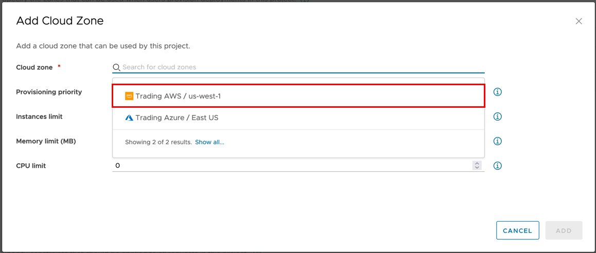
</figure>

>_**Note:** If the only available AWS Cloud Zone is **Trading AWS / us-east-1**, then please select that Cloud Zone._

15. Leave all remaining settings as their defaults and click **ADD**.

<figure>
    
</figure>

16. Repeat **Steps 12** to **Step 15** to also add the **Trading Azure** Cloud Zone to the project.

<figure>
    
</figure>

17. Scroll down the Provisioning tab locate the **Custom Naming** template field.

<figure>
    
</figure>

18. Under **Custom Naming**, at the **Template** textbox, type `${resource.name}${####}`.

<figure>
    
</figure>

> _**Note:** Using a basic custom naming template provides some consistency around the naming policy of deployment resources._

19. Click **CREATE**.

<figure>
    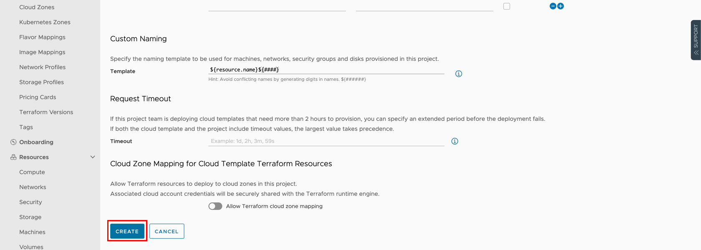
</figure>

-----

### Exercise 2 - Creating a Flavor Mapping

In this exercise we are going to create two new Flavor Mappings.

1. Under **Configure**, click **Flavor Mappings**.

<figure>
    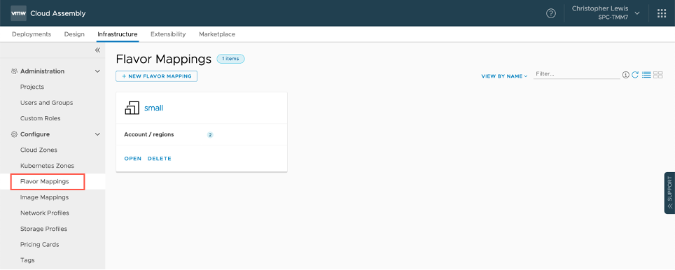
</figure>

2. Click **+ NEW FLAVOR MAPPING**.

<figure>
    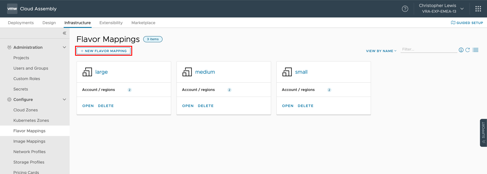
</figure>

3. On the **New Flavor Mapping** screen, at the **Name** field, type `extra large`.

<figure>
    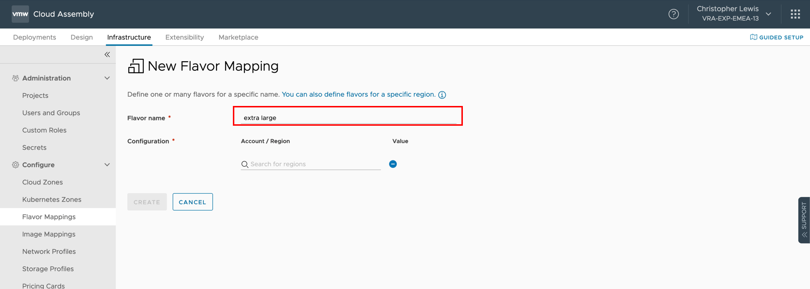
</figure>

4. Under **Configuration**, click on the **Account/Region** field and select **Trading AWS / us-west-1**.

<figure>
    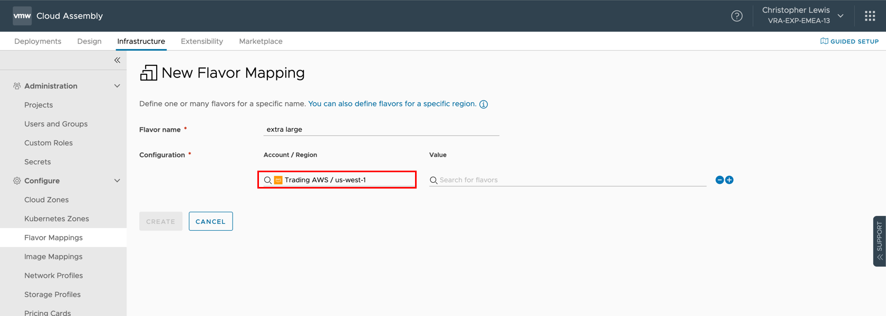
</figure>

5. At the **Value** field, type `t3.xlarge` and select **t3.xlarge** from the list.

<figure>
    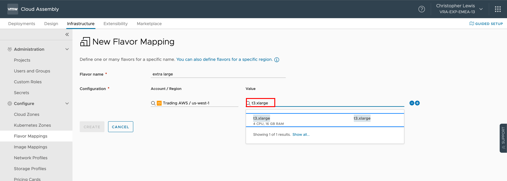
</figure>

6. Select **t3.xlarge** from the list.

<figure>
    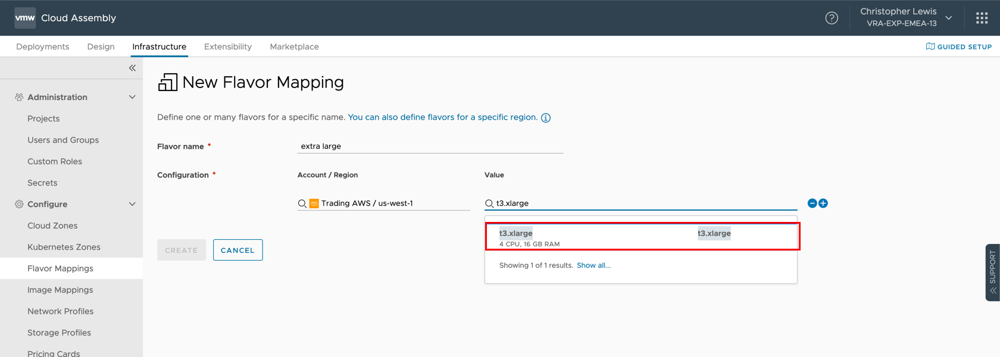
</figure>

7. Click **+** to add a new Configuration.

<figure>
    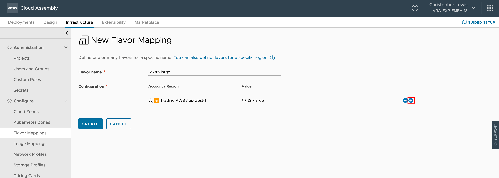
</figure>

8. Repeat **Step 4** to **Step 6** to add another configuration for the **Trading Azure / East US** Account/Region using the **Standard_B4ms** resource type.

<figure>
    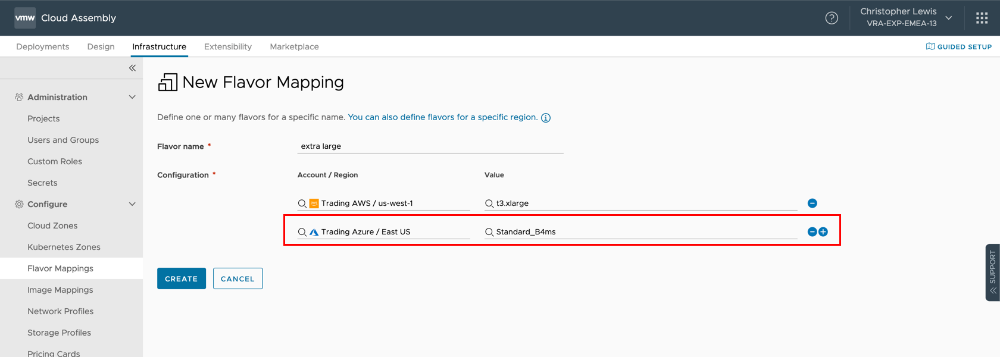
</figure>

9. Click **CREATE**.

<figure>
    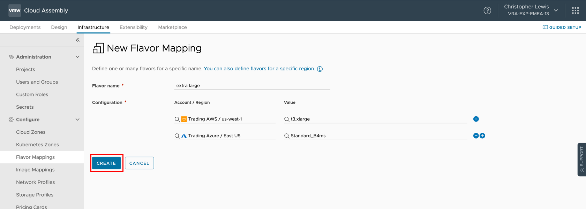
</figure>

10. Repeat **Step 3** to **Step 9** to create another **Flavor Mapping** with the following information.

<table class="table">
    <caption>Table: Module 2 - Exercise 2</caption>
    <thead>
        <tr>
            <th class="left">Name</th>
            <th class="left">Account/Region 1</th>
            <th class="left">Resource Type 1</th>
            <th class="left">Account/Region 2</th>
            <th class="left">Resource Type 2</th>
        </tr>
    </thead>
    <tbody>
        <tr>
            <td class="left">tiny  </td>
            <td class="left">Trading AWS / us-west-1</td>
            <td class="left">t3.nano</td>
            <td class="left">Trading Azure / East US</td>
            <td class="left">Standard_B1ls</td>
        </tr>
    </tbody>
</table>

-----

### Exercise 3 - Create an Image Mapping

In this exercise we are going to create a new image mapping that can be used in future Modules.

1. Under **Configure**, click **Image Mappings**.

<figure>
    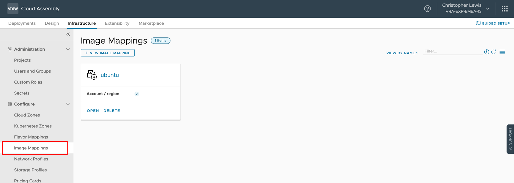
</figure>

2. Click **+ NEW IMAGE MAPPING**.

<figure>
    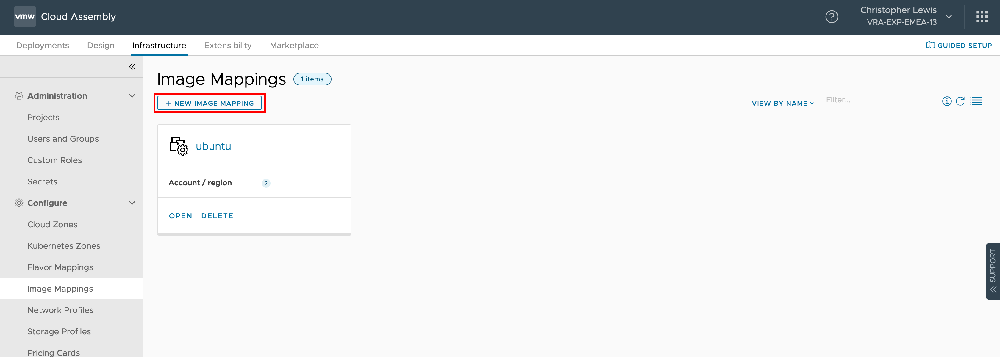
</figure>

3. On the **New Image Mapping** screen, at the **name** field, type `windows server 2019`.

<figure>
    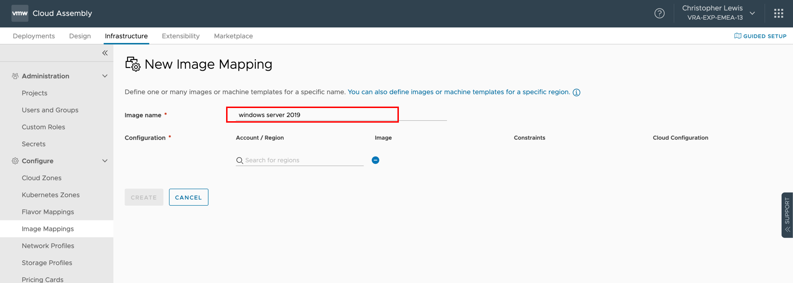
</figure>

4. Under **Configuration**, click on the **Account/Region** field and select **Trading AWS / us-west-1**.

<figure>
    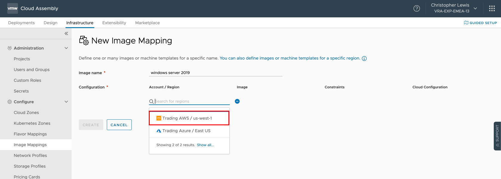
</figure>

5. At the the **Image** field, type `Microsoft Windows Server 2019`.

<figure>
    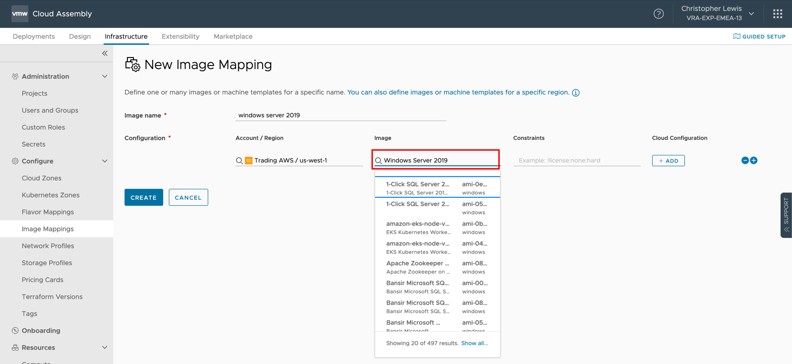
</figure>

6. Click **Show all** from the search list.

<figure>
    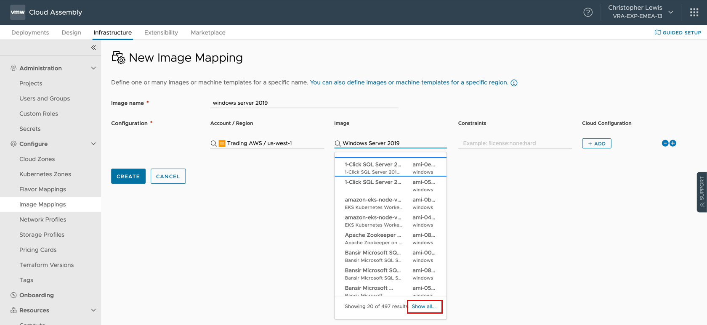
</figure>

7. At **Select Image** dialog, scroll down and highlight the **Microsoft Windows Server 2019** AMI and then click **SELECT**.

<figure>
    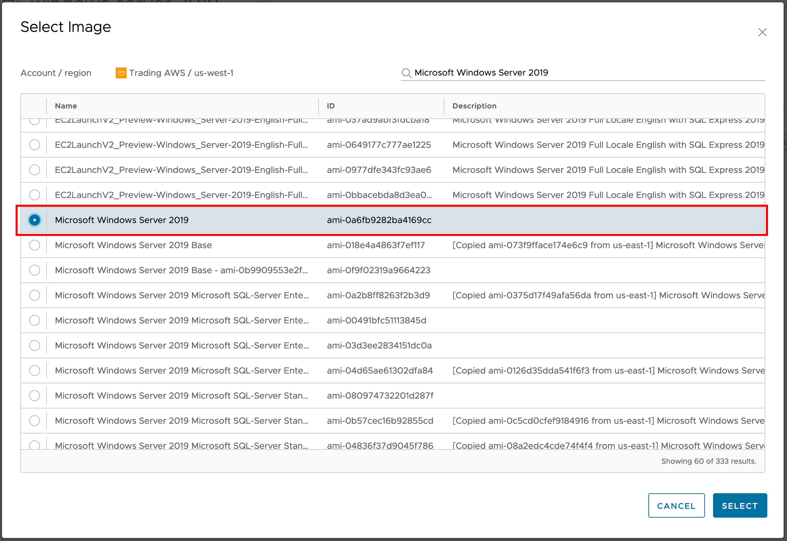
</figure>

8. Click **+** to add a new Configuration.

<figure>
    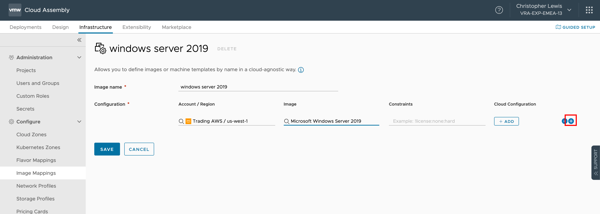
</figure>

9. Repeat **Step 4** to **Step 8** to add the **Trading Azure / uswest** to the **Account/Region** field and using `MicrosoftWindowsServer:WindowsServer:2019-Datacenter:latest` as the image.

<figure>
    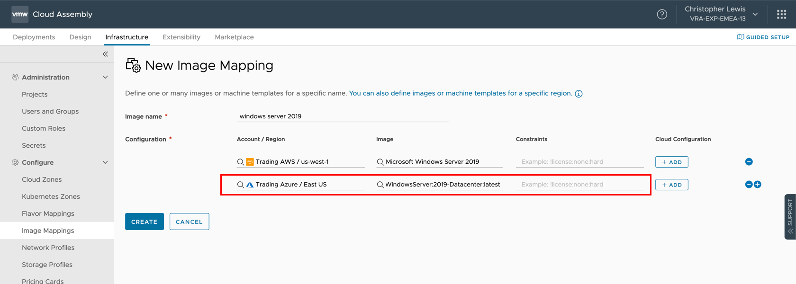
</figure>

10. Click **CREATE**.

<figure>
    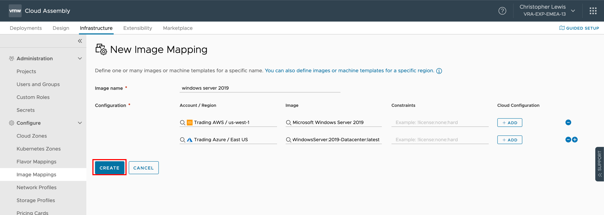
</figure>

11. Repeat **Step 2** through **Step 10** to create another **Image Mapping** with the following information.

<table class="table">
    <caption>Table: Module 2 - Exercise 3</caption>
    <thead>
        <tr>
            <th class="left">Name</th>
            <th class="left">Account/Region 1</th>
            <th class="left">Resource Type 1</th>
            <th class="left">Account/Region 2</th>
            <th class="left">Resource Type 2</th>
        </tr>
    </thead>
    <tbody>
        <tr>
            <td class="left">centos</td>
            <td class="left">Trading AWS / us-west-1</td>
            <td class="left">CentOS Linux 7 x86_64 HVM EBS ENA 1907</td>
            <td class="left">Trading Azure / East US</td>
            <td class="left">OpenLogic:CentOS:7.5:latest</td>
        </tr>
    </tbody>
</table>

> _**Note:** If the exact image name does not exist, then choose the nearest option to it._

-----

### Exercise 4 - Update a Network Profile

In this Exercise we are going to add some additional networks to existing Network Profile.

1. Select **Configure** > **Network Profiles**.
2. Locate the trading aws network profile card, click Open.
3. Click the **Networks** tab.
4. Click **Add Network**.
5. At the **Add Network** dialog, check the checkbox for the **appnet-public-dev** network.
6. Click **ADD**.
7. Click **Save**.
8. Check the trading azure network profile to confirm that the **vNETXX-Public-SPC** included.  

> _**Note:** If the vNETXX-Public-SPC is not already within the network profile, then repeat Step 3 to Step 8 to add it._
