# Lab Guide: Module 2 - Configuring vRealize Automation in Cloud Assembly

## Introduction

## Lab Overview

* [Exercise 1 - Creating a vRealize Automation Project](#exercise-1-\--creating-a-vrealize-automation-project)
* [Exercise 2 - Creating a Flavor Mapping](#exercise-2-\--creating-a-flavor-mapping)
* [Exercise 3 - Create an Image Mapping](#exercise-3-\--create-an-image-mapping)
* [Exercise 4 - Update a Network Profile](#exercise-4-\--update-a-network-profile)

## Exercises

### Exercise 1 - Creating a vRealize Automation Project

1. Click the **VMware Cloud Assembly** service.

<figure>
    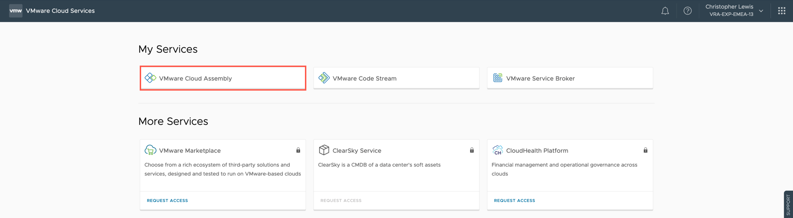
</figure>

2. Select the **Infrastructure** tab.

<figure>
    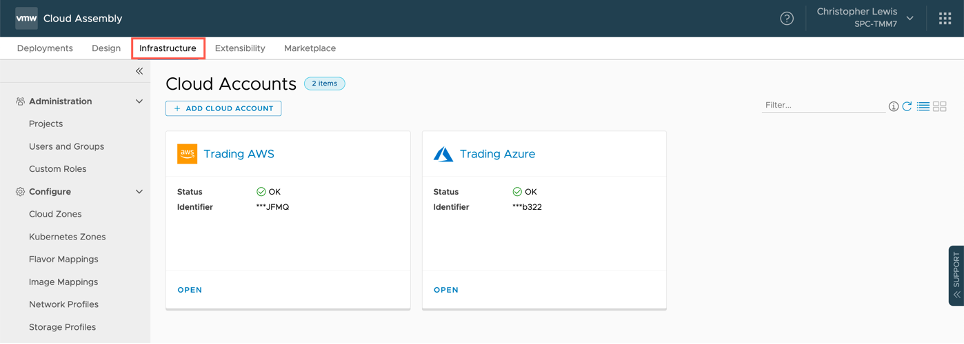
</figure>

3. Select **Administration** > **Projects**.

<figure>
    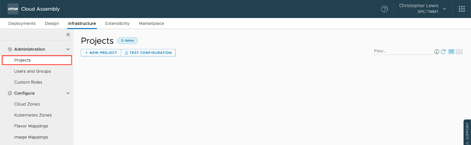
</figure>

4. Click **+ NEW PROJECT**.

<figure>
    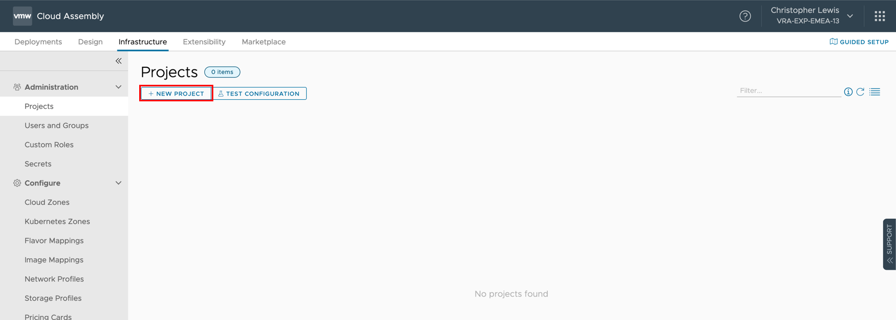
</figure>

5. At the **New Project** screen, type a name for the project.

<figure>
    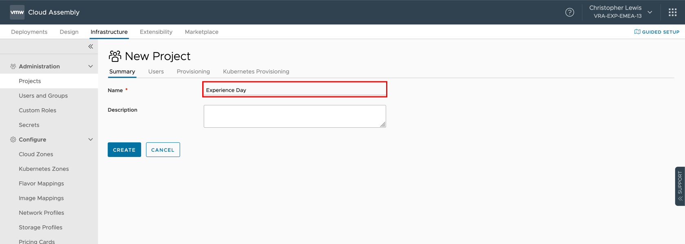
</figure>

> _**Note:** The **Project Name** can be anything you like but you need to remember it as you will use this project for the rest of the day!_

6. Click **Users**.

<figure>
    
</figure>

7. Click **+ADD USERS**.

<figure>
    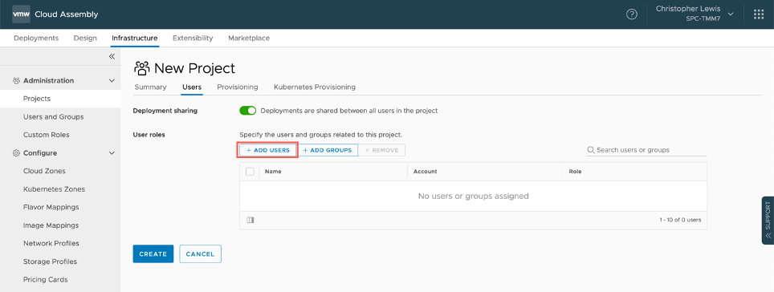
</figure>

8. Type your email address into the **Users** text field and click **Enter**.

<figure>
    <a href="./img/m2-e1-img08.png">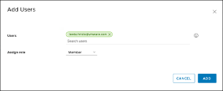</a>
</figure>

9. Select **Administrator** from the **Assign role** dropdown.

<figure>
    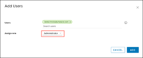
</figure>

10. Click **ADD**.

<figure>
    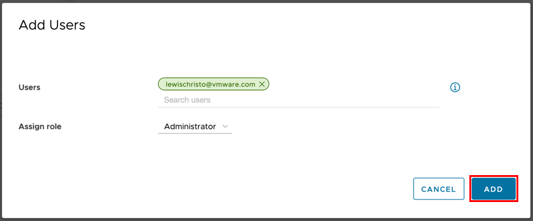
</figure>

> _**Note:** If we had integrated vRealize Automation Cloud into an Enterprise Directory (such as Active Directory) and then synchronized certain AD Users Groups, then we could have specified an AD User Group here._

11. Click **Provisioning**.

<figure>
    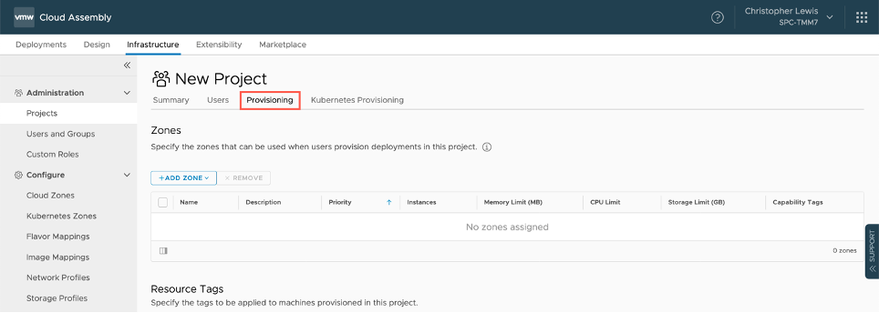
</figure>

12. Click **Add Zone**.

<figure>
    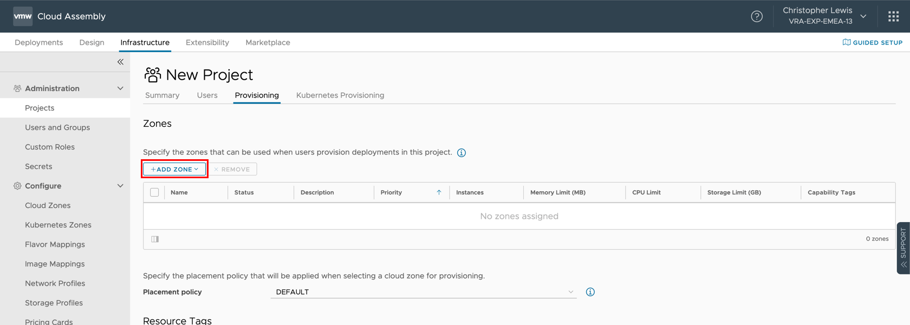
</figure>

13. Click **Cloud Zone**.

<figure>
    
</figure>

14. At the **Add Cloud Zone** dialog, click the Cloud zone search field and select Trading AWS / us-west-1 from the list.

>_**Note:** If the only available AWS Cloud Zone is Trading AWS / us-east-1, then please select that Cloud Zone._

<figure>
    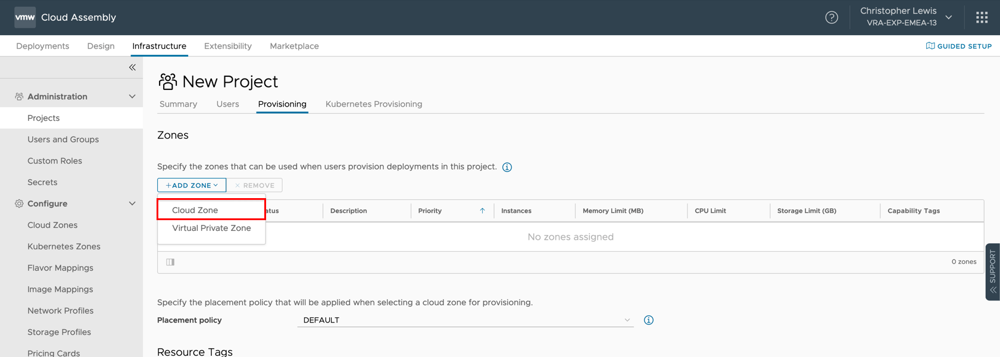
</figure>

15. Leave all remaining settings as their defaults and click Add.

<figure>
    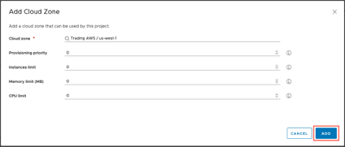
</figure>

Now that the Trading AWS Cloud Zone has been added to the project as a provisioning resource.  This means that a user can create blueprints and provision machines and services against this project.

<figure>
    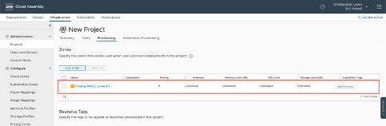
</figure>

16. Repeat Steps 12 to Step 15 to add also the **Trading Azure Cloud Zone** to the current project.

<figure>
    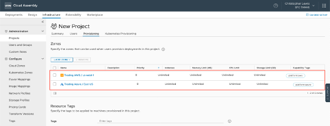
</figure>

17. Click on **Summary** and then click **CREATE**.

<figure>
    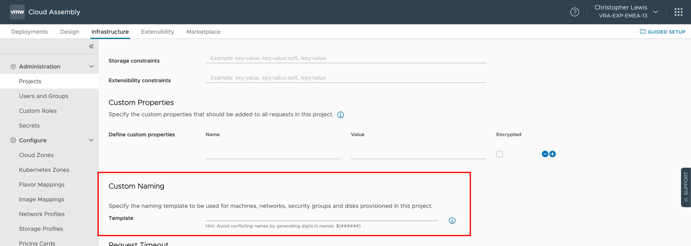
</figure>

You should now have a new project to start provision against!

<figure>
    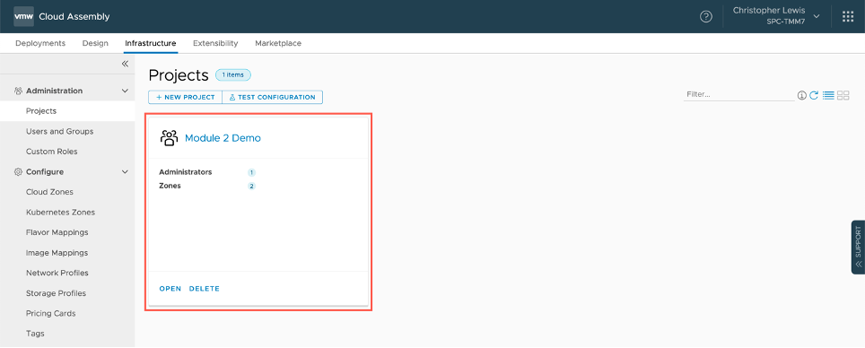
</figure>

-----

### Exercise 2 - Creating a Flavor Mapping

In this exercise we are going to create two new flavor mappings that could be used in future Modules.

1. Select the **Infrastructure** tab. (if required).
2. Select **Configure** > **Flavor Mappings**.
3. Click **NEW FLAVOR MAPPING**.
4. On the **New Flavor Mapping** screen, type **medium** into the **Name** field.
5. Under Configuration, Select **Trading AWS / us-west-1** as the **Account/Region**.
6. At the value field, type **t2.** and select **t2.medium** from the list.
7. Click **+** to add a new Configuration.
8. Repeat Step 4 to Step 6 to add an configuration for the **Trading Azure / uswest** Account/Region using the **Standard_A2** resource type.
9. Click Create.
10. Repeat Step 3 to Step 9 to create another **Flavor Mapping** with the following information.

<table class="table">
    <caption>Table: Module 2 - Exercise 2</caption>
    <thead>
        <tr>
            <th class="left">Key</th>
            <th class="left">Value</th>
        </tr>
    </thead>
    <tbody>
        <tr>
            <td class="left">Name</td>
            <td class="left">large</td>
        </tr>
        <tr>
            <td class="left">Account/Regions</td>
            <td class="left">Trading AWS / us-west-1</td>
        </tr>
        <tr>
            <td class="left">Resource Type</td>
            <td class="left">t2.large</td>
        </tr>
        <tr>
            <td class="left">Account/Regions</td>
            <td class="left">Trading Azure / uswest</td>
        </tr>
        <tr>
            <td class="left">Resource Type</td>
            <td class="left">Standard_B4ms</td>
        </tr>
    </tbody>
</table>

-----

### Exercise 3 - Create an Image Mapping

In this exercise we are going to create a new image mapping that can be used in future Modules.

1. Select the **Infrastructure** tab.
2. Select **Configure** > **Image** Mappings.
3. Click **NEW IMAGE MAPPING**.
4. On the **New Image Mapping** screen, type **Windows Server 2019** as the name.
5. Under **Configuration**, select **Trading AWS / us-west-1** as the **Account/Region**.
6. Under **Configuration**, type **Microsoft Windows Server 2019** into the **Image** field and click **Show all** from the search window.
11. At **Select Image** dialog, scroll down and highlight the **Microsoft Windows Server 2019 AMI** and then click **SELECT**.
12. Click **+** to add a new Configuration.
13. Repeat Step 4 to Step 10 to add the **Trading Azure / uswest** to the **Account/Region** field and using the **MicrosoftWindowsServer:WindowsServer:2019-Datacenter:latest** as the image.
14. Click **CREATE**.
15. Repeat Step 3 through Step 14 to create another **Image Mapping** with the following information.

<table class="table">
    <caption>Table: Module 2 - Exercise 3</caption>
    <thead>
        <tr>
            <th class="left">Key</th>
            <th class="left">Image Mapping 1</th>
            <th class="left">Image Mapping 2</th>
        </tr>
    </thead>
    <tbody>
        <tr>
            <td class="left">Name</td>
            <td class="left">Centos</td>
            <td class="left">large</td>
        </tr>
        <tr>
            <td class="left">Account/Regions</td>
            <td class="left">Trading AWS / us-west-1</td>
            <td class="left">Trading Azure / uswest</td>
        </tr>
        <tr>
            <td class="left">Image Type</td>
            <td class="left">CentOS Linux 7 x86_64 HVM EBS ENA 1905</td>
            <td class="left">OpenLogic:CentOS:7.5:latest</td>
        </tr>
    </tbody>
</table>

Feel free to create addition Image Mappings.

> _**Note:** If the exact image name does not exist, then choose the nearest option to it._

-----

### Exercise 4 - Update a Network Profile

In this Exercise we are going to add some additional networks to existing Network Profile.
1. Select the **Infrastructure** tab (if required).
2. Select **Configure** > **Network Profiles**.
3. Locate the trading aws network profile card, click Open.
4. Click the **Networks** tab.
5. Click **Add Network**.
6. At the **Add Network** dialog, check the checkbox for the **appnet-public-dev** network.
7. Click **ADD**.
8. Click **Save**.
9. Check the trading azure network profile to confirm that the **vNETXX-Public-SPC** included.  

> _**Note:** If the vNETXX-Public-SPC is not already within the network profile, then repeat Step 3 to Step 8 to add it._
