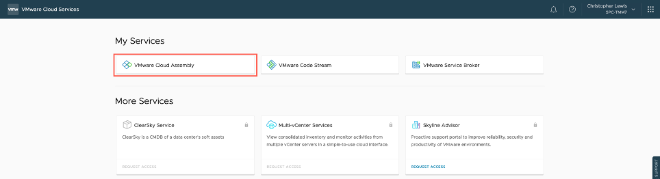

# Lab Guide: Module 2 - Configuring vRealize Automation in Cloud Assembly

## Exercise 1 - Create a Project

1. Click the **VMware Cloud Assembly** service.
<figure>
    
</figure>
2. Select the **Infrastructure** tab.
3. Select **Administration** > **Projects**.
4. Click **NEW PROJECT**.
5. At the New Project screen, enter a Name for the project.
_Note: The Project Name can be anything you like but you need to remember it as you will use this project for the rest of the day._
6. Click Users.
7. Click Add Users.
8. Type your email address into the Users text field and click Enter.
9. Select Administrator from the Assign role dropdown.
10. Click Add.
_Note: If we had integrated vRealize Automation Cloud into an Enterprise Directory (such as Active Directory) and then synchronized certain AD Users Groups, then we could have specified an AD User Group here._
11. Click Provisioning.
12. Click Add Zone.
13. Click Cloud Zone.
14. At the Add Cloud Zone dialog, click the Cloud zone search field and select Trading AWS / us-west-1 from the list.
_Note: If the only available AWS Cloud Zone is Trading AWS / us-east-1, then please select that Cloud Zone._
15. Leave all remaining settings as their defaults and click Add.
Now that the Trading AWS Cloud Zone has been added to the project as a provisioning resource.  This means that a user can create blueprints and provision machines and services against this project.
16. Repeat Steps 12 to Step 15 to add also the Trading Azure Cloud Zone to the current project.
17. Click on Summary and then click Create.
You should now have a new project to start provision against!
  
## Exercise 2 - Create Flavor Mappings

In this exercise we are going to create two new flavor mappings that could be used in future Modules.
1. Select the Infrastructure tab. (if required).
2. Select Configure > Flavor Mappings.
3. Click New Flavor Mapping.
4. On the New Flavor Mapping screen, enter medium as the name.
5. Under Configuration, Select Trading AWS / us-west-1 as the Account/Region.
6. At the value field, type t2. and select t2.medium from the list.
7. Click plus (+) to add a new Configuration.
8. Repeat Step 4 to Step 6 to add an configuration for the Trading Azure / uswest Account/Region using the Standard_A2 resource type.
9. Click Create.
10. Repeat Step 3 to Step 9 to create another **Flavor Mapping** with the following information.

<table class="table">
    <caption>Table: Module 2 – Exercise 2</caption>
    <thead>
        <tr>
            <th class="left">Key</th>
            <th class="left">Value</th>
        </tr>
    </thead>
    <tbody>
        <tr>
            <td class="left">Name</td>
            <td class="left">large</td>
        </tr>
        <tr>
            <td class="left">Account/Regions</td>
            <td class="left">Trading AWS / us-west-1</td>
        </tr>
        <tr>
            <td class="left">Resource Type</td>
            <td class="left">t2.large</td>
        </tr>
        <tr>
            <td class="left">Account/Regions</td>
            <td class="left">Trading Azure / uswest</td>
        </tr>
        <tr>
            <td class="left">Resource Type</td>
            <td class="left">STandard_B4ms</td>
        </tr>
    </tbody>
</table>

## Exercise 3 - Create Image Mappings

In this exercise we are going to create a new image mapping that can be used in future Modules.
1. Select the Infrastructure tab.
2. Select Configure > Image Mappings.
3. Click New Image Mapping.
4. On the New Image Mapping screen, type Windows Server 2019 as the name.
5. Under Configuration, select Trading AWS / us-west-1 as the Account/Region.
6. Under Configuration, type Microsoft Windows Server 2019 into the Image field and click Show all… from the search window.
11. At Select Image dialog, scroll down and then select the Microsoft Windows Server 2019 AMI and then click SELECT.
12. Click plus (+) to add a new Configuration.
13. Repeat Step 4 to Step 10 to add the Trading Azure / uswest to the Account/Region field and using the MicrosoftWindowsServer:WindowsServer:2019-Datacenter:latest as the image.
14. Click Create.
15. Repeat Step 3 to Step 14 to create another Image Mapping with the following information.
Module 2 – Exercise 3
Key Value
Name CentOS7
Account/Regions Trading AWS / us-west-1
AWS Image CentOS Linux 7 x86_64 HVM EBS ENA 1905
Account/Regions Trading Azure / uswest
Azure Image OpenLogic:CentOS:7.5:latest

Feel free to create addition Image Mappings.

## Exercise 4 – Add Networks to a Network Profile

In this Exercise we are going to add some additional networks to existing Network Profile.
1. Select the Infrastructure tab.
2. Select Configure > Network Profiles.
3. Locate the trading aws network profile card, click Open.
4. Click the Networks tab.
5. Click Add Network.
6. At the Add Network dialog, check the checkbox for the appnet-public-dev network.
7. Click ADD.
8. Click Save.
9. Check the trading azure network profile to confirm that the vNETXX-Public-SPC included.  If it is not, then repeat Step 3 to Step 8 to add it.
